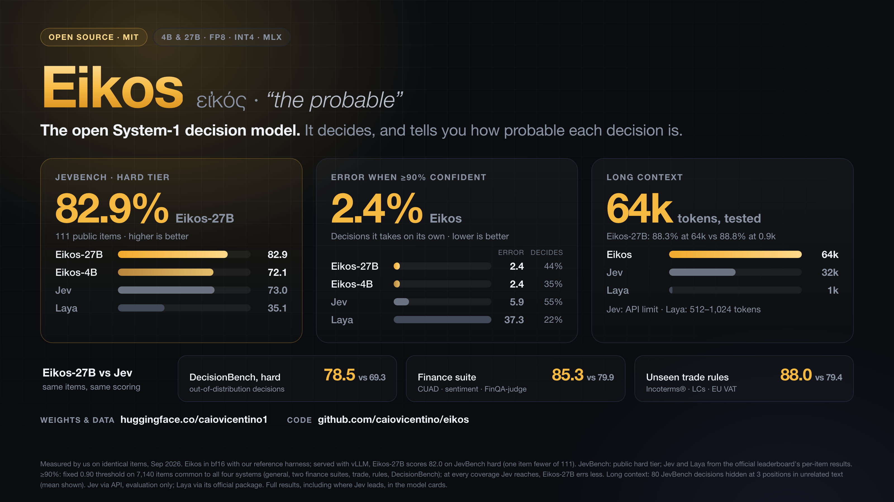
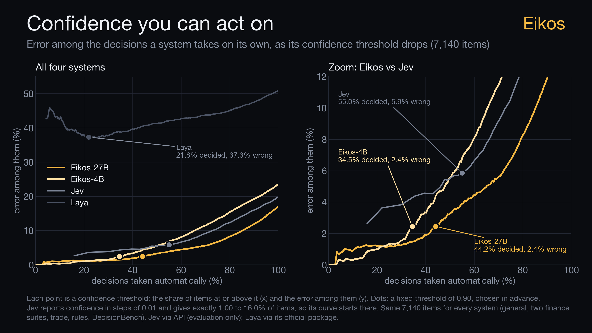

# Eikos



**Eikos** (εἰκός, *"the probable"*) is a family of open typed-decision models, released under MIT. Each model:
- answers a structured question about a given state in **one forward pass**;
- returns a **calibrated probability for every option**, so a caller can act on confident decisions and escalate
  the rest.

It comes in two sizes, Eikos-4B and Eikos-27B, each with bf16, FP8 and INT4 GPU builds and MLX builds for Apple
Silicon. The focus is global finance, trading and trade finance: applying stated rules, policies and rulebooks to
a case.

This repository contains everything used to build the models:
- the serving and inference code;
- the data pipeline;
- training;
- quantization;
- the evaluation harness.

- Models: `caiovicentino1/Eikos-4B`, `caiovicentino1/Eikos-27B` (with `-FP8`, `-INT4` and `-MLX` builds).
- Data: `caiovicentino1/eikos-decisions`, the exact training data with per-row attribution.

| Headline (our harness, same items for every system) | Eikos-27B | Eikos-4B | Jev | Laya |
|---|---|---|---|---|
| JevBench public, hard tier | **82.9** | 72.1 | 73.0 | 35.1 |
| Error when ≥90% confident (7,140 items, 6 suites) | **2.4%** | **2.4%** | 5.9% | 37.3% |
| Accuracy with the decision hidden in 64k tokens (mean of 3 positions) | **88.3** | 74.2 | — (API limit 32k) | — (512–1k context) |



The model cards have the full tables, the per-build validation (bf16, FP8, INT4, MLX) and the limitations.

## Layout

| Folder | What it holds |
|---|---|
| `eikos/` | Inference library and server:<br>• `decision_core` (prompt, options, tournament for >26 options);<br>• `letter_adapter` (letter-logit readout; PyTorch, SGLang and vLLM backends; prefix cache);<br>• `serve.py` (HTTP API + agent sessions);<br>• `mlx_decide.py` (Apple Silicon). |
| `examples/` | Local demo and a game-loop latency benchmark |
| `scripts/` | `serve_vllm.sh` (production serving), `train_final.sh` (exact final recipes), `build_eval_suites.sh` |
| `data_pipeline/` | Item generation with blind teacher labeling (`gen_pipeline.py`), programmatic generators (`prog_*.py`), long-context dossiers, PT↔EN views, decontamination and the training snapshot |
| `training/` | Trainer (`train_dec.py`: soft cross-entropy on letter logits, rationale loss, view consistency, optional JEPA losses), LoRA merge and export to the official checkpoint layout, model soup, merge check |
| `quantization/` | FP8 and INT4 (GPTQ) with llm-compressor, MLX validation, and the gate that compares builds with bf16 on the same items |
| `evaluation/` | vLLM and PyTorch harnesses, JevBench and DecisionBench runners, suite builders, long-context probe, parallelism benchmark, release tables, and the Jev and Laya comparisons |
| `release_tools/` | Builds the public dataset, including its decontamination and privacy scans, and converts it back to the trainer's format |

## Install

```bash
git clone https://github.com/caiovicentino/eikos eikos && cd eikos
pip install -e .              # inference library (torch + transformers)
pip install -e ".[vllm]"      # production serving: vLLM >= 0.30.0 is REQUIRED (see below)
pip install -e ".[mlx]"       # Apple Silicon
pip install -e ".[train]"     # data pipeline, training and evaluation
pip install -e ".[quant]"     # FP8 / INT4 quantization (llm-compressor)
cp .env.example .env          # working dirs and optional API endpoints; then: set -a; source .env; set +a
```

## Serve

```bash
scripts/serve_vllm.sh <MODEL_DIR> 8001                        # vLLM engine (letter readout + hybrid prefix cache)
python eikos/serve.py --model <MODEL_DIR> --vllm-url http://127.0.0.1:8001 --port 8000
```

> **vLLM ≥ 0.30.0 is required.** On this hybrid (Gated DeltaNet) architecture, older builds return wrong answers
> when several long requests are batched together. We measured drops of 3–6 points on long, shared-document items
> with vLLM 0.11. With 0.30, batched results match the PyTorch reference. `serve_vllm.sh` refuses to start on older
> versions.

```bash
curl -s localhost:8000/v1/systemone -d '{
  "state": "Order ticket #A-2231. Retail client. BUY 1,500 XYZ at market. Equity USD 48,000. Last price USD 41.20. Rule 4.2: a single order may not exceed 50% of equity without written supervisor approval. Approvals on file: none.",
  "questions": {
    "allowed": {"type": "noul", "instructions": "Under rule 4.2, can this order be executed as submitted?",
                "criteria": {"true": "complies with rule 4.2", "false": "breaches rule 4.2"}},
    "action":  {"type": "choice", "instructions": "What should the desk do?",
                "criteria": {"execute": "send as submitted", "request_approval": "hold and ask a supervisor",
                             "reduce_size": "cut the order to the allowed size", "reject": "refuse the order"}}
  }}'
```

All questions in a request are answered in one pass over the shared state, which the prefix cache processes once.
The server also supports agent sessions with an incremental state: `POST /v1/sessions`, `.../append`,
`.../systemone`.

On a Mac:

```bash
python eikos/mlx_decide.py <MLX_MODEL_DIR>
python examples/local_demo.py <MODEL_DIR> mps
```

## Reproduce

Everything below reads and writes under `EIKOS_HOME` (default: the current directory) and `EIKOS_RUNS` (default:
`runs/`).

### 1. Data

The simplest path is to start from the released dataset and convert it back to the trainer's format:

```bash
hf download caiovicentino1/eikos-decisions --repo-type dataset --local-dir eikos-decisions
python release_tools/release_to_train.py eikos-decisions snap_4b eikos-4b    # or: snap_27b eikos-27b
```

The conversion is lossless. The train, dev and held-out assignment and the soft targets match our runs exactly.
The release does leave out 2% of the rows we trained on (see the dataset card), so a retrained model will be close
to ours but not bit-identical.

To regenerate the data from scratch instead:
1. **Generated items** (`data_pipeline/gen_pipeline.py`).
   - A writer model writes items with a gold answer and a rationale. A teacher labels them blindly, and only items
     where the teacher agrees with the gold answer are kept.
   - The teacher is GLM-5.3-Flash at maximum reasoning effort, on any OpenAI-compatible endpoint
     (`TEACHER_API_URL`, `TEACHER_API_KEY`).
   - The writer is the same GLM, or a local Qwen3.8-27B server (`GEN_API`, `GEN_MODEL`).
2. **Programmatic items with exact answers:**
   - `python data_pipeline/prog_{prob,temporal,fin,trade,rules}.py N SEED > data/prog_*.jsonl`;
   - `prog_rules.py --holdout` makes the new-domain rules;
   - `prog_finjudge.py` (TAT-QA) and `dedup_finjudge.py`;
   - `prog_judge.py Qwen/Qwen3.5-0.8B cuda:0 data/prog_judge.jsonl` (GSM8K train) and `fix_judge.py`;
   - `prog_finentity.py FinEntity.json` (human-labeled entity sentiment).
3. **Long-context dossiers and views:** `make_long.py` builds the dossiers; `make_views.py` makes the PT↔EN
   translations and needs a translation endpoint.
4. **Snapshot:** `data_pipeline/snapshot_final.sh <snapshot_dir>`. It sets the per-source quotas and applies
   8-gram decontamination against the public JevBench items. It also excludes FinQA-derived items and the trade
   rule families reserved for evaluation.

### 2. Train

```bash
hf download Qwen/Qwen3.5-4B --local-dir models/Qwen3.5-4B
BASE_MODEL=models/Qwen3.5-4B scripts/train_final.sh 4b-B 0 ckpt/4b_B snap_4b snap_4b/views.jsonl.views
BASE_MODEL=models/Qwen3.5-4B scripts/train_final.sh 4b-E 1 ckpt/4b_E snap_4b snap_4b/views.jsonl.views
python training/merge_export.py models/Qwen3.5-4B ckpt/4b_B/adapter ckpt/4b_B/standalone ckpt/4b_B/calib.json
python training/merge_export.py models/Qwen3.5-4B ckpt/4b_E/adapter ckpt/4b_E/standalone ckpt/4b_E/calib.json
python training/make_soup.py Eikos-4B ckpt/4b_B/standalone_release ckpt/4b_E/standalone_release   # released 4B
# 27B: scripts/train_final.sh 27b <gpu> ckpt/27b snap_27b, then merge_export.py (its *_release folder is Eikos-27B)
```

The final recipes:
- LoRA rank 64, 1 epoch, learning rate 1e-4;
- soft cross-entropy on the option-letter logits, with option-order permutation;
- auxiliary rationale loss with weight 0.3;
- PT↔EN views with a symmetric KL of 0.5 (4B);
- light JEPA losses of 0.2 (recipe E).

`merge_export.py` writes the model in the **official Qwen checkpoint layout**, so the same folder loads in
transformers, vLLM and SGLang. `training/check_merged.py` checks that the merged model reproduces base + LoRA.

The released models use **T = 1** (`calib.json`). The model card explains why.

### 3. Quantize

```bash
python quantization/quantize_llmc.py Eikos-4B Eikos-4B-FP8 fp8
CALIB_SNAPSHOT=snap_4b python quantization/quantize_llmc.py Eikos-4B Eikos-4B-INT4 int4 256   # GPTQ W4A16, 256 training items
mlx_lm convert --hf-path Eikos-4B --mlx-path Eikos-4B-MLX-8bit -q --q-bits 8 --q-group-size 64   # 4-bit: --q-bits 4
```

A build ships only if it passes the gate against bf16 on the same items (`quantization/compare_quant.py`):
- accuracy within 1 point;
- ECE within 0.01;
- at least 97% of answers unchanged.

We also report where the changed answers fall. They are mostly on items where bf16 itself was unsure.

### 4. Evaluate

```bash
scripts/build_eval_suites.sh             # rebuilds the third-party suites from their sources (evaluation only)
cp eikos-decisions/eval/suite_*.jsonl .  # our own trade and rules suites ship with the dataset
python evaluation/eval_vllm_suite.py Eikos-4B ALL rel_4b_bf16 0.85   # 7 suites, vLLM, batching + prefix cache
python evaluation/release_table.py rel   # accuracy per suite, ECE, and the >=0.90 decide/error policy
python evaluation/probe_long_ctx.py Eikos-27B 0.85 80                # decision hidden in 4k/16k/64k tokens, 3 depths
python evaluation/bench_vllm_prefix.py Eikos-4B all 0.85             # parallelism: many questions over one state
```

`evaluation/eval_jev_suite.py` and `evaluation/eval_laya_suite.py` run the same suites through Jev (API, evaluation
only; `JEV_API_URL` and `JEV_API_KEY`) and Laya (official `laya` package). `evaluation/compare_models.py` builds the
side-by-side table.

## Notes

- **No evaluation data was used for training.**
  - The dataset card lists the decontamination checks against every suite we report.
  - The held-out family, topic and language (Spanish) are never trained on.
- **Scope:**
  - The models apply the rules they are given. They do not predict prices, and they are not legal, tax or
    investment advice.
  - Single-pass models do not do long multi-step reasoning; see RuleArena in the model card.

## License

- **Code:** MIT (`LICENSE`).
- **Models:** MIT for our fine-tuning deltas; the base models are Apache-2.0.
- **Data:** CC BY 4.0, with per-row upstream licenses.
- **Third-party credits** are listed in `NOTICE`.

## Citation

```bibtex
@misc{eikos2026,
  title  = {Eikos: open, calibrated, single-pass typed-decision models for finance and trading},
  author = {Caio Vicentino},
  year   = {2026},
  url    = {https://github.com/caiovicentino/eikos}
}
```
